# 🔬 Plan de Implementación Técnico Detallado
## Sistema Agéntico MVP - Fases 4.3 a 6.3

> **Fecha de Análisis:** 9 de Octubre 2025
> **Basado en:** Análisis exhaustivo del código actual
> **Filosofía:** SHIPPING > PERFECCIÓN + Implementación Quirúrgica

---

## 📐 Arquitectura Actual - Estado Base

### Stack Técnico Verificado
```python
# Framework
FastAPI 0.104+ (con lifespan asynccontextmanager)
Pydantic 2.x (settings con validation)
SQLAlchemy 2.x (async ORM)

# Base de Datos
PostgreSQL 16 (con btree_gist para daterange exclusion)
Redis 7 (para locks y rate limiting)

# Observabilidad
prometheus-client (métricas expuestas en /metrics)
structlog (logging JSON estructurado)
prometheus-fastapi-instrumentator (auto-instrumentation)

# Workers
asyncio.create_task() en lifespan (2 workers activos)
  - expiration_worker: 300s interval (configurable JOB_EXPIRATION_INTERVAL_SECONDS)
  - ical_worker: 300s interval (configurable JOB_ICAL_INTERVAL_SECONDS)
```

### Estructura de Servicios (Patrón Service Layer)
```
backend/app/services/
├── reservations.py   → ReservationService (create_prereservation, confirm, etc.)
├── mercadopago.py    → MercadoPagoService (create_preference, process_webhook)
├── ical.py           → ICalService (import_events, export_feed, sync)
├── email.py          → EmailService (send via SMTP)
├── whatsapp.py       → WhatsAppService (send_message, download_media)
├── audio.py          → AudioProcessor (transcribe con whisper)
└── nlu.py            → NLUService (detect_intent, extract_entities)
```

### Middleware Stack Actual (Orden de Ejecución)
```python
# main.py - Orden TOP -> BOTTOM en ejecución
1. prometheus-fastapi-instrumentator (auto /metrics)
2. CORSMiddleware (CORS policy)
3. rate_limit middleware (Redis-based, bypass: /healthz, /readyz, /metrics)
4. add_request_id middleware (UUID + structlog context)
```

### Routers Actuales
```
/api/v1/healthz         → health.health_check() [latencias DB/Redis]
/api/v1/readyz          → health.readiness_check() [simple OK]
/api/v1/reservations    → reservations_router (CRUD pre-reservas)
/api/v1/mercadopago     → mercadopago_router (webhooks, status)
/api/v1/whatsapp        → whatsapp_router (webhooks entrantes)
/api/v1/ical            → ical_router (export feeds, sync)
/api/v1/audio           → audio_router (upload, transcribe)
/api/v1/admin           → admin_router (gestión alojamientos)
/api/v1/nlu             → nlu_router (detect intent, test)
```

### Métricas Prometheus Actuales (metrics.py)
```python
# Ya implementadas
NLU_PRE_RESERVE (Counter)
PRERESERVATIONS_EXPIRED (Counter por accommodation_id)
PRERESERVATION_EXPIRY_DURATION (Histogram)
PRERESERVATION_REMINDERS_SENT (Counter por channel)
ICAL_LAST_SYNC_AGE_MIN (Gauge global)
ICAL_SYNC_AGE_MINUTES (Gauge por accommodation)
ICAL_SYNC_ERRORS (Counter por accommodation + error_type)
ICAL_SYNC_DURATION (Histogram)
ICAL_EVENTS_IMPORTED (Counter)
ICAL_EVENTS_UPDATED (Counter)
```

### Tests Actuales (22 tests pasando)
```
backend/tests/
├── conftest.py                    → Fixtures: db_session, test_client, redis, factories
├── test_background_jobs.py        → 6 tests (workers expiración/reminders)
├── test_health_checks.py          → 16 tests (health/readyz)
├── test_double_booking.py         → Constraint anti-overlap
├── test_constraint_validation.py  → Edge cases daterange
└── ... (otros tests de routers/services)
```

---

## 🎯 FASE 4.3: Rate Limiting y Protección Básica

### Objetivo Técnico
Convertir el rate limiting actual (simple fixed window) en un sistema observ able, configurable y con métricas detalladas, sin cambiar la lógica core que ya funciona.

---

### 4.3.1 Análisis del Código Actual

**Ubicación:** `backend/app/main.py` líneas 128-156

**Implementación Actual:**
```python
@app.middleware("http")
async def rate_limit(request: Request, call_next):
    try:
        if not settings.RATE_LIMIT_ENABLED or settings.ENVIRONMENT == "development":
            return await call_next(request)
        path = request.url.path
        # No limitar healthz, readyz ni metrics
        if path in ("/api/v1/healthz", "/api/v1/readyz", "/metrics"):
            return await call_next(request)
        # Fixed window per IP + path
        client_ip = request.client.host if request.client else "unknown"
        key = f"ratelimit:{client_ip}:{path}"
        pool = get_redis_pool()
        import redis.asyncio as redis
        r = redis.Redis(connection_pool=pool)
        count = await r.incr(key)
        if count == 1:
            await r.expire(key, settings.RATE_LIMIT_WINDOW_SECONDS)
        if count > settings.RATE_LIMIT_REQUESTS:
            logger.warning("rate_limited", ip=client_ip, path=path, count=int(count))
            return JSONResponse(status_code=429, content={"error": "Too Many Requests"})
        return await call_next(request)
    except Exception:  # fail-open
        return await call_next(request)
```

**Problemas Identificados:**
1. ❌ No hay métricas: Bloqueados no se cuentan en Prometheus
2. ❌ Thresholds fijos: No se puede ajustar por endpoint
3. ❌ Fail-open silencioso: Errores de Redis no se observan
4. ❌ IP forwarding: No maneja X-Forwarded-For (Nginx/proxy)

---

### 4.3.2 Implementación Detallada

#### Paso 1: Agregar Métricas (backend/app/metrics.py)

**Archivo:** `backend/app/metrics.py`
**Línea de inserción:** Después de línea 62 (al final)

```python
# Rate Limiting Metrics
RATE_LIMIT_REQUESTS_BLOCKED = Counter(
    "rate_limit_requests_blocked_total",
    "Total de requests bloqueados por rate limiting",
    ["ip", "path", "reason"],
)

RATE_LIMIT_REDIS_ERRORS = Counter(
    "rate_limit_redis_errors_total",
    "Errores de Redis en rate limiting (fail-open)",
    ["error_type"],
)

RATE_LIMIT_CURRENT_COUNT = Gauge(
    "rate_limit_current_count",
    "Contador actual de requests por IP+path (sampled)",
    ["ip", "path"],
)

RATE_LIMIT_THRESHOLD_BY_PATH = Gauge(
    "rate_limit_threshold_by_path",
    "Threshold configurado por path",
    ["path"],
)
```

**Validación Post-Implementación:**
```bash
# Verificar métricas exportadas
curl http://localhost:8000/metrics | grep rate_limit

# Debería mostrar:
# rate_limit_requests_blocked_total{ip="...",path="...",reason="..."} 0
# rate_limit_redis_errors_total{error_type="..."} 0
```

---

#### Paso 2: Crear Utilidad de Rate Limiting (backend/app/core/rate_limit.py)

**Archivo NUEVO:** `backend/app/core/rate_limit.py`

```python
"""Rate limiting utilities con configuración por endpoint."""

from __future__ import annotations

import redis.asyncio as redis
import structlog
from fastapi import Request
from typing import Optional, Dict

from app.core.config import get_settings
from app.core.redis import get_redis_pool
from app.metrics import (
    RATE_LIMIT_REQUESTS_BLOCKED,
    RATE_LIMIT_REDIS_ERRORS,
    RATE_LIMIT_CURRENT_COUNT,
    RATE_LIMIT_THRESHOLD_BY_PATH,
)

logger = structlog.get_logger()
settings = get_settings()

# Configuración de thresholds por path (se puede mover a settings si crece)
PATH_RATE_LIMITS: Dict[str, tuple[int, int]] = {
    # path: (requests, window_seconds)
    "/api/v1/whatsapp": (100, 60),      # WhatsApp webhook: 100 req/min
    "/api/v1/mercadopago": (100, 60),   # Mercado Pago webhook: 100 req/min
    "/api/v1/audio": (10, 60),          # Audio transcription: 10 req/min (costoso)
    "/api/v1/reservations": (30, 60),   # Reservas: 30 req/min
    "/api/v1/nlu": (50, 60),            # NLU: 50 req/min
    # Default para otros paths usa settings globales
}

# Paths que NUNCA se rate-limitan
BYPASS_PATHS = {"/api/v1/healthz", "/api/v1/readyz", "/metrics", "/api/docs", "/api/redoc"}


def get_client_ip(request: Request) -> str:
    """Obtener IP real del cliente considerando proxies.

    Soporta X-Forwarded-For y X-Real-IP (Nginx, CloudFlare, etc.).
    """
    # Prioridad 1: X-Forwarded-For (puede ser comma-separated)
    forwarded_for = request.headers.get("X-Forwarded-For")
    if forwarded_for:
        # Tomar la primera IP (original client)
        return forwarded_for.split(",")[0].strip()

    # Prioridad 2: X-Real-IP (Nginx simple proxy)
    real_ip = request.headers.get("X-Real-IP")
    if real_ip:
        return real_ip.strip()

    # Fallback: IP directa
    return request.client.host if request.client else "unknown"


def get_rate_limit_config(path: str) -> tuple[int, int]:
    """Obtener configuración de rate limit para un path.

    Returns:
        tuple[int, int]: (max_requests, window_seconds)
    """
    # Configuración específica por path
    if path in PATH_RATE_LIMITS:
        return PATH_RATE_LIMITS[path]

    # Configuración default desde settings
    return (settings.RATE_LIMIT_REQUESTS, settings.RATE_LIMIT_WINDOW_SECONDS)


async def check_rate_limit(request: Request) -> Optional[dict]:
    """Verificar rate limit para un request.

    Returns:
        None si OK, dict con error si bloqueado
    """
    path = request.url.path

    # Bypass: health checks, metrics, docs
    if path in BYPASS_PATHS:
        return None

    # Bypass: development mode
    if not settings.RATE_LIMIT_ENABLED or settings.ENVIRONMENT == "development":
        return None

    client_ip = get_client_ip(request)
    max_requests, window_seconds = get_rate_limit_config(path)

    # Actualizar métrica de threshold (para observabilidad)
    try:
        RATE_LIMIT_THRESHOLD_BY_PATH.labels(path=path).set(max_requests)
    except Exception:  # nosec B110 - metric failure non-critical
        pass

    # Key Redis: ratelimit:{ip}:{path}
    key = f"ratelimit:{client_ip}:{path}"

    try:
        pool = get_redis_pool()
        r = redis.Redis(connection_pool=pool)

        # Fixed window algorithm: INCR + EXPIRE si es primera request
        count = await r.incr(key)
        if count == 1:
            await r.expire(key, window_seconds)

        # Actualizar gauge de count actual (sampled, no todos los requests)
        if count % 10 == 0:  # Sample cada 10 requests para no saturar
            try:
                RATE_LIMIT_CURRENT_COUNT.labels(ip=client_ip, path=path).set(count)
            except Exception:  # nosec B110
                pass

        await r.close()

        # Verificar threshold
        if count > max_requests:
            # Métrica de bloqueado
            RATE_LIMIT_REQUESTS_BLOCKED.labels(
                ip=client_ip,
                path=path,
                reason="threshold_exceeded"
            ).inc()

            logger.warning(
                "rate_limit_blocked",
                ip=client_ip,
                path=path,
                count=int(count),
                threshold=max_requests,
                window_seconds=window_seconds
            )

            return {
                "error": "Too Many Requests",
                "detail": f"Rate limit exceeded: {max_requests} requests per {window_seconds}s",
                "retry_after": window_seconds
            }

        return None  # OK

    except Exception as e:
        # Fail-open: Si Redis falla, NO bloqueamos
        RATE_LIMIT_REDIS_ERRORS.labels(error_type=type(e).__name__).inc()
        logger.error(
            "rate_limit_redis_error",
            error=str(e),
            ip=client_ip,
            path=path,
            fail_open=True
        )
        return None  # Permitir request en caso de error
```

**Validación:**
```python
# Tests unitarios para verificar lógica
def test_get_client_ip_with_forwarded_for():
    """Debe extraer IP de X-Forwarded-For."""
    # Mock request con header
    # Assert IP correcta

def test_get_rate_limit_config_custom_path():
    """Debe retornar config específica para /api/v1/audio."""
    # Assert (10, 60)

def test_check_rate_limit_bypass_healthz():
    """Health check no debe rate-limitarse."""
    # Mock request a /api/v1/healthz
    # Assert None (OK)
```

---

#### Paso 3: Refactorizar Middleware (backend/app/main.py)

**Archivo:** `backend/app/main.py`
**Sección a reemplazar:** Líneas 128-156 (middleware rate_limit actual)

**ANTES:**
```python
@app.middleware("http")
async def rate_limit(request: Request, call_next):
    try:
        if not settings.RATE_LIMIT_ENABLED or settings.ENVIRONMENT == "development":
            return await call_next(request)
        path = request.url.path
        # ... código actual ...
    except Exception:
        return await call_next(request)
```

**DESPUÉS:**
```python
@app.middleware("http")
async def rate_limit(request: Request, call_next):
    """Rate limiting middleware con métricas y configuración por endpoint."""
    from app.core.rate_limit import check_rate_limit

    # Verificar rate limit
    error_response = await check_rate_limit(request)

    if error_response:
        # Bloqueado: retornar 429
        return JSONResponse(
            status_code=429,
            content=error_response,
            headers={"Retry-After": str(error_response.get("retry_after", 60))}
        )

    # OK: continuar con request
    return await call_next(request)
```

**Beneficios:**
- ✅ Código mucho más limpio (lógica separada)
- ✅ Testeable independientemente
- ✅ Métricas integradas
- ✅ Configuración centralizada

---

#### Paso 4: Tests Completos (backend/tests/test_rate_limiting.py)

**Archivo NUEVO:** `backend/tests/test_rate_limiting.py`

```python
"""Tests completos para rate limiting con métricas."""

from __future__ import annotations

import pytest
from fastapi import status
from unittest.mock import patch, AsyncMock


@pytest.mark.asyncio
async def test_rate_limit_blocks_after_threshold(test_client):
    """Debe bloquear después de exceder threshold."""
    # Hacer 31 requests a /api/v1/nlu (threshold: 50)
    responses = []
    for _ in range(60):  # Exceder 50
        response = await test_client.get("/api/v1/nlu/health")  # endpoint dummy
        responses.append(response)

    # Las primeras 50 deben pasar, las siguientes bloquearse
    passing = [r for r in responses if r.status_code == 200]
    blocked = [r for r in responses if r.status_code == 429]

    assert len(passing) >= 50
    assert len(blocked) >= 10

    # Verificar respuesta de bloqueado
    if blocked:
        data = blocked[0].json()
        assert "error" in data
        assert data["error"] == "Too Many Requests"
        assert "retry_after" in data


@pytest.mark.asyncio
async def test_rate_limit_custom_threshold_audio(test_client):
    """Audio debe tener threshold bajo (10 req/min)."""
    # Hacer 15 requests a /api/v1/audio
    responses = []
    for _ in range(15):
        # Mock upload para no procesar audio real
        response = await test_client.get("/api/v1/audio/status")  # endpoint dummy
        responses.append(response)

    # Debe bloquear después de 10
    blocked = [r for r in responses if r.status_code == 429]
    assert len(blocked) >= 5


@pytest.mark.asyncio
async def test_rate_limit_bypass_healthz(test_client):
    """Health checks no deben rate-limitarse."""
    # Hacer 200 requests (mucho más que threshold)
    responses = []
    for _ in range(200):
        response = await test_client.get("/api/v1/healthz")
        responses.append(response)

    # Todos deben pasar
    assert all(r.status_code == 200 for r in responses)


@pytest.mark.asyncio
async def test_rate_limit_x_forwarded_for(test_client):
    """Debe usar X-Forwarded-For para IP real."""
    # Hacer requests con header X-Forwarded-For
    headers = {"X-Forwarded-For": "203.0.113.1, 198.51.100.1"}

    responses = []
    for _ in range(60):
        response = await test_client.get("/api/v1/nlu/health", headers=headers)
        responses.append(response)

    # Debe rate-limitar basado en 203.0.113.1 (primera IP)
    blocked = [r for r in responses if r.status_code == 429]
    assert len(blocked) > 0


@pytest.mark.asyncio
async def test_rate_limit_fail_open_on_redis_error(test_client):
    """Si Redis falla, debe permitir request (fail-open)."""
    with patch("app.core.rate_limit.get_redis_pool") as mock_pool:
        # Mock Redis error
        mock_pool.side_effect = Exception("Redis connection failed")

        # Request debe pasar (fail-open)
        response = await test_client.get("/api/v1/nlu/health")

        # NO debe bloquear
        assert response.status_code != 429


@pytest.mark.asyncio
async def test_rate_limit_metrics_exported(test_client):
    """Métricas de rate limiting deben exportarse."""
    # Hacer requests que bloqueen
    for _ in range(60):
        await test_client.get("/api/v1/nlu/health")

    # Verificar /metrics
    response = await test_client.get("/metrics")
    metrics_text = response.text

    # Debe contener métricas de rate limiting
    assert "rate_limit_requests_blocked_total" in metrics_text
    assert "rate_limit_threshold_by_path" in metrics_text


@pytest.mark.asyncio
async def test_rate_limit_window_resets(test_client):
    """Contador debe resetear después de window expira."""
    import asyncio

    # Hacer 50 requests (al límite)
    for _ in range(50):
        await test_client.get("/api/v1/nlu/health")

    # Esperar que expire window (config test: 1 segundo)
    await asyncio.sleep(2)

    # Próximo request debe pasar (counter reseteado)
    response = await test_client.get("/api/v1/nlu/health")
    assert response.status_code == 200


@pytest.mark.asyncio
async def test_rate_limit_different_ips_independent(test_client):
    """IPs diferentes deben tener contadores independientes."""
    # IP 1: hacer 50 requests
    headers_ip1 = {"X-Forwarded-For": "203.0.113.1"}
    for _ in range(50):
        await test_client.get("/api/v1/nlu/health", headers=headers_ip1)

    # IP 2: debe poder hacer requests (contador independiente)
    headers_ip2 = {"X-Forwarded-For": "203.0.113.2"}
    response = await test_client.get("/api/v1/nlu/health", headers=headers_ip2)

    assert response.status_code == 200  # No bloqueado
```

**Estimación de Tests:** 9 tests, ~45 min para implementar

---

#### Paso 5: Configuración y Documentación

**Archivo:** `backend/app/core/config.py`
**Verificar que existan estas variables:**

```python
class Settings(BaseSettings):
    # ... existentes ...

    # Rate Limiting
    RATE_LIMIT_ENABLED: bool = True
    RATE_LIMIT_REQUESTS: int = 100  # Default global
    RATE_LIMIT_WINDOW_SECONDS: int = 60  # Default window
```

**Archivo NUEVO:** `docs/RATE_LIMITING.md`

```markdown
# Rate Limiting - Documentación Técnica

## Configuración por Endpoint

| Endpoint | Requests | Window | Razón |
|----------|----------|--------|-------|
| `/api/v1/whatsapp` | 100 | 60s | Webhooks WhatsApp (burst capability) |
| `/api/v1/mercadopago` | 100 | 60s | Webhooks Mercado Pago |
| `/api/v1/audio` | 10 | 60s | Transcripción costosa (Whisper) |
| `/api/v1/reservations` | 30 | 60s | Prevención de spam |
| `/api/v1/nlu` | 50 | 60s | NLU processing |
| Otros | 100 | 60s | Default global |

## Bypass Automático

- `/api/v1/healthz`, `/api/v1/readyz`, `/metrics` - Observabilidad
- `/api/docs`, `/api/redoc` - Documentación
- Development mode (`ENVIRONMENT=development`)

## Algoritmo

**Fixed Window:** Counter por IP+path, expira en window_seconds

## Headers de Respuesta

```http
HTTP/1.1 429 Too Many Requests
Content-Type: application/json
Retry-After: 60

{
  "error": "Too Many Requests",
  "detail": "Rate limit exceeded: 50 requests per 60s",
  "retry_after": 60
}
```

## Métricas Prometheus

```promql
# Requests bloqueados por IP
rate_limit_requests_blocked_total{ip="...", path="...", reason="threshold_exceeded"}

# Errores de Redis (fail-open)
rate_limit_redis_errors_total{error_type="ConnectionError"}

# Contador actual (sampled)
rate_limit_current_count{ip="...", path="..."}

# Thresholds configurados
rate_limit_threshold_by_path{path="/api/v1/audio"}
```

## Fail-Open Policy

Si Redis falla, el sistema permite requests (no bloquea). Esto prioriza disponibilidad sobre protección estricta.

## Proxy Support

Soporta `X-Forwarded-For` y `X-Real-IP` para obtener IP real detrás de Nginx/CloudFlare.
```

---

### 4.3.3 Checklist de Implementación

**Orden de Ejecución (Para evitar errores de dependencia):**

- [ ] **Día 1 Mañana (2h):**
  - [ ] Crear `backend/app/core/rate_limit.py` (funciones utilitarias)
  - [ ] Agregar métricas en `backend/app/metrics.py`
  - [ ] Verificar que compila: `python -m py_compile backend/app/core/rate_limit.py`

- [ ] **Día 1 Tarde (2h):**
  - [ ] Refactorizar middleware en `backend/app/main.py`
  - [ ] Verificar que app levanta: `make up && curl http://localhost:8000/api/v1/healthz`
  - [ ] Verificar métricas: `curl http://localhost:8000/metrics | grep rate_limit`

- [ ] **Día 2 Mañana (3h):**
  - [ ] Crear `backend/tests/test_rate_limiting.py` (9 tests)
  - [ ] Ejecutar tests: `pytest backend/tests/test_rate_limiting.py -v`
  - [ ] Ajustar fixtures en `conftest.py` si necesario (config test para window corto)

- [ ] **Día 2 Tarde (1h):**
  - [ ] Crear documentación `docs/RATE_LIMITING.md`
  - [ ] Verificar pre-commit hooks pasando
  - [ ] Commit y push: "feat(security): Rate limiting observable con métricas por endpoint"

---

### 4.3.4 Validación Post-Implementación

**Checklist de Calidad:**

```bash
# 1. Tests pasando
pytest backend/tests/test_rate_limiting.py -v
# Expect: 9/9 tests PASSED

# 2. Métricas exportadas
curl http://localhost:8000/metrics | grep -E "rate_limit_(requests_blocked|threshold)"
# Expect: Ambas métricas presentes

# 3. Health checks sin rate limit
for i in {1..200}; do curl -s http://localhost:8000/api/v1/healthz > /dev/null; done
echo "Health checks: OK (no 429)"

# 4. Rate limit funcionando
for i in {1..60}; do curl -s http://localhost:8000/api/v1/nlu/health; done | grep -c "429"
# Expect: >= 10 (bloqueados después de 50)

# 5. X-Forwarded-For support
curl -H "X-Forwarded-For: 203.0.113.99" http://localhost:8000/api/v1/healthz
# Expect: Log debe mostrar IP 203.0.113.99

# 6. Fail-open test (detener Redis)
docker stop redis_container
curl http://localhost:8000/api/v1/nlu/health
# Expect: 200 OK (no 429), log debe mostrar error Redis
docker start redis_container
```

---

### 4.3.5 Riesgos y Mitigaciones

| Riesgo | Probabilidad | Impacto | Mitigación |
|--------|--------------|---------|------------|
| Redis latency afecta requests | Media | Alto | Usar asyncio con timeout, fail-open si excede 100ms |
| Memory leak en Gauge por muchas IPs | Baja | Medio | Sampling (actualizar cada 10 requests), TTL en labels |
| Bypass accidental de paths críticos | Baja | Alto | Tests específicos para cada path, code review |
| Race condition en INCR+EXPIRE | Baja | Bajo | SQLAlchemy/Redis atómicos, test de concurrencia |

---

## 🚀 FASE 5: Quick Wins UX (2-3 días)

### Objetivo Técnico
Mejorar mensajes y respuestas automáticas sin cambiar flujo core, usando templates y contexto.

---

### 5.1 Análisis del Código Actual - WhatsApp Service

**Ubicación:** `backend/app/services/whatsapp.py`

**Implementación Actual (Líneas ~50-100):**
```python
class WhatsAppService:
    async def send_message(
        self,
        to: str,
        message_text: str,
        message_type: str = "text"
    ) -> Dict[str, Any]:
        """Enviar mensaje de texto a WhatsApp."""
        url = f"{self.GRAPH_API_URL}/{self.PHONE_NUMBER_ID}/messages"
        payload = {
            "messaging_product": "whatsapp",
            "to": to,
            "type": "text",
            "text": {"body": message_text}
        }
        # ... headers, request ...
```

**Problemas Identificados:**
1. ❌ Mensajes hard-coded en routers (no reutilizables)
2. ❌ No usa contexto de conversación (nombre usuario, fecha, alojamiento)
3. ❌ No soporta templates de WhatsApp Business (botones, listas)
4. ❌ Respuestas genéricas sin personalización

---

### 5.1.1 Implementación: Sistema de Templates

#### Paso 1: Crear Template Engine (backend/app/templates/messages.py)

**Archivo NUEVO:** `backend/app/templates/messages.py`

```python
"""Sistema de templates para mensajes contextuales."""

from __future__ import annotations

from typing import Dict, Any, Optional
from string import Template
from datetime import date, datetime


class MessageTemplate:
    """Template con sustitución de variables y personalización."""

    # Templates base (español argentino, tono amigable)
    TEMPLATES = {
        # Saludos
        "greeting_first": Template(
            "¡Hola $name! 👋 Soy el asistente de reservas. "
            "¿En qué puedo ayudarte?"
        ),
        "greeting_return": Template(
            "¡Hola de nuevo $name! 😊 ¿Qué necesitás?"
        ),

        # Disponibilidad
        "availability_check": Template(
            "Chequeando disponibilidad para $accommodation del "
            "$check_in al $check_out ($nights noche/s) para $guests persona/s... 🔍"
        ),
        "available_yes": Template(
            "✅ ¡Buenas noticias! $accommodation está disponible.\n\n"
            "📅 Check-in: $check_in\n"
            "📅 Check-out: $check_out\n"
            "👥 Huéspedes: $guests\n"
            "💰 Precio total: $$price ARS ($nights noche/s a $$price_per_night)\n\n"
            "¿Querés reservar?"
        ),
        "available_no": Template(
            "❌ Lo siento, $accommodation no está disponible para esas fechas.\n\n"
            "¿Querés probar con otras fechas?"
        ),

        # Pre-reserva
        "prereservation_created": Template(
            "✅ ¡Pre-reserva creada!\n\n"
            "📋 Código: *$code*\n"
            "🏠 Alojamiento: $accommodation\n"
            "📅 $check_in → $check_out ($nights noche/s)\n"
            "💰 Total: $$price ARS\n"
            "💳 Seña ($deposit_pct%): $$deposit ARS\n\n"
            "⏱️ Tenés $expiry_minutes minutos para confirmar con la seña.\n\n"
            "Link de pago: $payment_url"
        ),
        "prereservation_reminder": Template(
            "⏰ Recordatorio: Tu pre-reserva *$code* expira en $remaining_minutes minutos.\n\n"
            "💳 Pagá la seña acá: $payment_url"
        ),
        "prereservation_expired": Template(
            "⏱️ Tu pre-reserva *$code* expiró por falta de pago.\n\n"
            "¿Querés hacer una nueva reserva?"
        ),

        # Confirmación
        "reservation_confirmed": Template(
            "🎉 ¡Reserva confirmada!\n\n"
            "✅ Código: *$code*\n"
            "🏠 $accommodation\n"
            "📅 $check_in → $check_out\n"
            "👤 $guest_name\n\n"
            "Te enviaremos los detalles de acceso unos días antes del check-in. "
            "¡Esperamos verte pronto! 😊"
        ),

        # Errores
        "error_invalid_dates": Template(
            "❌ Las fechas no son válidas. Recordá:\n"
            "- Check-in debe ser antes que check-out\n"
            "- No se puede reservar en el pasado\n\n"
            "¿Podés volver a indicar las fechas?"
        ),
        "error_date_overlap": Template(
            "❌ Ups, alguien se adelantó y reservó esas fechas. 😔\n\n"
            "¿Querés probar con otras fechas?"
        ),
        "error_generic": Template(
            "😅 Disculpá, hubo un problema técnico.\n\n"
            "¿Podés intentar de nuevo en unos segundos?"
        ),

        # NLU - No entendió
        "nlu_unclear": Template(
            "🤔 No entendí bien tu mensaje.\n\n"
            "Podés decirme cosas como:\n"
            "- \"¿Está disponible del 15 al 20 de diciembre?\"\n"
            "- \"Quiero reservar para 4 personas\"\n"
            "- \"¿Cuánto sale?\"\n\n"
            "¿Qué necesitás?"
        ),
    }

    @classmethod
    def render(cls, template_name: str, **kwargs) -> str:
        """Render template con variables.

        Args:
            template_name: Nombre del template
            **kwargs: Variables a sustituir

        Returns:
            str: Mensaje renderizado

        Example:
            >>> MessageTemplate.render("greeting_first", name="Juan")
            "¡Hola Juan! 👋 ..."
        """
        template = cls.TEMPLATES.get(template_name)
        if not template:
            raise ValueError(f"Template '{template_name}' no existe")

        # Formatear fechas si vienen como objetos
        formatted_kwargs = {}
        for key, value in kwargs.items():
            if isinstance(value, (date, datetime)):
                formatted_kwargs[key] = value.strftime("%d/%m/%Y")
            elif isinstance(value, (int, float)) and key.startswith("price"):
                # Formatear precios con separador de miles
                formatted_kwargs[key] = f"{value:,.2f}".replace(",", ".")
            else:
                formatted_kwargs[key] = value

        try:
            return template.safe_substitute(**formatted_kwargs)
        except Exception as e:
            # Fallback: retornar template sin sustituir
            return template.template

    @classmethod
    def add_custom_template(cls, name: str, template_str: str):
        """Agregar template custom en runtime (para admin)."""
        cls.TEMPLATES[name] = Template(template_str)


# Helper functions para casos comunes

def format_currency(amount: float) -> str:
    """Formatear monto en ARS."""
    return f"${amount:,.2f}".replace(",", ".").replace("$", "ARS ")


def calculate_nights(check_in: date, check_out: date) -> int:
    """Calcular noches entre fechas."""
    return (check_out - check_in).days


def expiry_remaining_minutes(expires_at: datetime) -> int:
    """Minutos restantes hasta expiración."""
    from datetime import timezone
    now = datetime.now(timezone.utc)
    if expires_at.tzinfo is None:
        expires_at = expires_at.replace(tzinfo=timezone.utc)
    delta = expires_at - now
    return max(0, int(delta.total_seconds() / 60))
```

**Validación:**
```python
# Tests unitarios
def test_render_greeting():
    msg = MessageTemplate.render("greeting_first", name="Juan")
    assert "¡Hola Juan!" in msg
    assert "👋" in msg

def test_render_with_date():
    from datetime import date
    msg = MessageTemplate.render(
        "availability_check",
        accommodation="Cabaña del Bosque",
        check_in=date(2025, 12, 15),
        check_out=date(2025, 12, 20),
        nights=5,
        guests=4
    )
    assert "15/12/2025" in msg
    assert "5 noche/s" in msg

def test_render_missing_var_graceful():
    # Si falta variable, no debe crashear
    msg = MessageTemplate.render("greeting_first")  # falta 'name'
    assert "$name" in msg or "Hola" in msg  # Fallback OK
```

---

#### Paso 2: Integrar en WhatsApp Router (backend/app/routers/whatsapp.py)

**Archivo:** `backend/app/routers/whatsapp.py`
**Ubicación modificar:** Función `handle_text_message` (línea ~150-200)

**ANTES:**
```python
async def handle_text_message(message: Dict, whatsapp_service):
    # ... extraer phone, text ...

    # Detección de intent
    intent_data = await nlu_service.detect_intent(text)

    if intent_data["intent"] == "disponibilidad":
        # HARD-CODED:
        response_text = f"Chequeando disponibilidad..."
        await whatsapp_service.send_message(phone, response_text)
```

**DESPUÉS:**
```python
from app.templates.messages import MessageTemplate, calculate_nights

async def handle_text_message(message: Dict, whatsapp_service, db: AsyncSession):
    # ... extraer phone, text, user_name ...

    # Detección de intent
    intent_data = await nlu_service.detect_intent(text)

    if intent_data["intent"] == "disponibilidad":
        # Extraer entidades
        check_in = intent_data.get("check_in")
        check_out = intent_data.get("check_out")
        guests = intent_data.get("guests", 2)

        # Obtener accommodation (por ahora default o del contexto)
        acc = await get_default_accommodation(db)

        # Mensaje contextual con template
        response_text = MessageTemplate.render(
            "availability_check",
            name=user_name,  # de contexto de conversación
            accommodation=acc.name,
            check_in=check_in,
            check_out=check_out,
            nights=calculate_nights(check_in, check_out),
            guests=guests
        )

        await whatsapp_service.send_message(phone, response_text)

        # Luego verificar disponibilidad real y responder con available_yes/no
        # ...

    elif intent_data["intent"] == "unclear":
        # Mensaje de ayuda contextual
        response_text = MessageTemplate.render("nlu_unclear", name=user_name)
        await whatsapp_service.send_message(phone, response_text)
```

**Beneficios:**
- ✅ Mensajes consistentes y bien escritos
- ✅ Fácil de cambiar sin tocar código (solo templates)
- ✅ Personalización con nombre de usuario
- ✅ Formato de fechas/precios correcto

---

#### Paso 3: Contexto de Conversación (backend/app/models/conversation.py)

**Archivo NUEVO:** `backend/app/models/conversation.py`

```python
"""Modelo para tracking de conversaciones (simple MVP)."""

from __future__ import annotations

from sqlalchemy import Column, String, Integer, DateTime, JSON, Index
from sqlalchemy.sql import func
from app.models.base import Base


class Conversation(Base):
    """Tracking de conversación para contexto."""

    __tablename__ = "conversations"

    id = Column(Integer, primary_key=True, index=True)

    # Identificación
    channel = Column(String(20), nullable=False)  # "whatsapp", "email"
    user_id = Column(String(255), nullable=False)  # phone o email
    user_name = Column(String(255), nullable=True)  # extraído de mensajes

    # Estado
    last_intent = Column(String(50), nullable=True)  # último intent detectado
    context = Column(JSON, nullable=True)  # {"accommodation_id": 1, "check_in": "..."}

    # Timestamps
    first_message_at = Column(DateTime(timezone=True), server_default=func.now())
    last_message_at = Column(DateTime(timezone=True), onupdate=func.now())

    # Índices para queries rápidas
    __table_args__ = (
        Index("idx_conversation_channel_user", "channel", "user_id"),
    )

    def __repr__(self):
        return f"<Conversation {self.channel}:{self.user_id}>"
```

**Migración Alembic:**
```bash
# Generar migración
cd backend
alembic revision --autogenerate -m "add_conversations_table"

# Aplicar
alembic upgrade head
```

**Uso en WhatsApp Handler:**
```python
async def get_or_create_conversation(
    db: AsyncSession,
    channel: str,
    user_id: str
) -> Conversation:
    """Obtener conversación existente o crear nueva."""
    stmt = select(Conversation).where(
        Conversation.channel == channel,
        Conversation.user_id == user_id
    )
    result = await db.execute(stmt)
    conv = result.scalar_one_or_none()

    if not conv:
        conv = Conversation(
            channel=channel,
            user_id=user_id,
            context={}
        )
        db.add(conv)
        await db.commit()
        await db.refresh(conv)

    return conv

# En handle_text_message:
conv = await get_or_create_conversation(db, "whatsapp", phone)

# Usar contexto
user_name = conv.user_name or "amigo/a"  # Fallback amigable
accommodation_id = conv.context.get("accommodation_id")

# Actualizar contexto después de cada mensaje
conv.last_intent = intent_data["intent"]
conv.context["last_query"] = text
conv.last_message_at = datetime.now(timezone.utc)
await db.commit()
```

---

### 5.1.2 Tests para Templates

**Archivo:** `backend/tests/test_message_templates.py`

```python
"""Tests para sistema de templates de mensajes."""

import pytest
from datetime import date, datetime, timedelta, timezone

from app.templates.messages import (
    MessageTemplate,
    calculate_nights,
    expiry_remaining_minutes
)


def test_greeting_first_template():
    """Template de saludo inicial debe incluir nombre."""
    msg = MessageTemplate.render("greeting_first", name="María")
    assert "María" in msg
    assert "👋" in msg
    assert "asistente" in msg.lower()


def test_availability_with_dates():
    """Template de disponibilidad debe formatear fechas correctamente."""
    msg = MessageTemplate.render(
        "availability_check",
        accommodation="Cabaña Vista al Lago",
        check_in=date(2025, 12, 25),
        check_out=date(2025, 12, 31),
        nights=6,
        guests=3
    )

    assert "25/12/2025" in msg
    assert "31/12/2025" in msg
    assert "6 noche/s" in msg
    assert "3 persona/s" in msg
    assert "Cabaña Vista al Lago" in msg


def test_prereservation_created_with_price():
    """Template de pre-reserva debe formatear precios."""
    msg = MessageTemplate.render(
        "prereservation_created",
        code="ABC123",
        accommodation="Cabaña",
        check_in=date(2025, 12, 20),
        check_out=date(2025, 12, 23),
        nights=3,
        price=45000.00,
        deposit_pct=30,
        deposit=13500.00,
        expiry_minutes=60,
        payment_url="https://mpago.la/abc123"
    )

    assert "ABC123" in msg
    assert "45.000" in msg or "45000" in msg  # Formato con puntos
    assert "13.500" in msg or "13500" in msg
    assert "60 minutos" in msg
    assert "https://mpago.la/abc123" in msg


def test_calculate_nights():
    """Helper debe calcular noches correctamente."""
    check_in = date(2025, 12, 20)
    check_out = date(2025, 12, 25)

    nights = calculate_nights(check_in, check_out)
    assert nights == 5


def test_expiry_remaining_minutes():
    """Helper debe calcular minutos restantes."""
    expires_at = datetime.now(timezone.utc) + timedelta(minutes=45)

    remaining = expiry_remaining_minutes(expires_at)
    assert 44 <= remaining <= 45  # Pequeño margen por ejecución


def test_template_missing_variable_graceful():
    """Template con variable faltante no debe crashear."""
    # safe_substitute no crashea, deja $var
    msg = MessageTemplate.render("greeting_first")  # Sin 'name'

    # Debe retornar algo (template o fallback)
    assert len(msg) > 0


def test_custom_template_addition():
    """Debe permitir agregar templates custom."""
    MessageTemplate.add_custom_template(
        "test_custom",
        Template("Hola $name, test custom")
    )

    msg = MessageTemplate.render("test_custom", name="Test")
    assert "Test" in msg
    assert "test custom" in msg
```

**Estimación:** 10 tests, ~30 min

---

### 5.1.3 Checklist de Implementación Fase 5.1

- [ ] **Día 1 Mañana (3h):**
  - [ ] Crear `backend/app/templates/messages.py` (templates + helpers)
  - [ ] Crear `backend/tests/test_message_templates.py` (10 tests)
  - [ ] Ejecutar tests: `pytest backend/tests/test_message_templates.py -v`

- [ ] **Día 1 Tarde (2h):**
  - [ ] Crear modelo `backend/app/models/conversation.py`
  - [ ] Generar migración Alembic: `alembic revision --autogenerate -m "add_conversations"`
  - [ ] Aplicar: `alembic upgrade head`
  - [ ] Verificar tabla creada: `psql -c "\d conversations"`

- [ ] **Día 2 Mañana (3h):**
  - [ ] Refactorizar `backend/app/routers/whatsapp.py` (usar templates)
  - [ ] Integrar context tracking (get_or_create_conversation)
  - [ ] Tests de integración: Enviar mensaje y verificar template usado

- [ ] **Día 2 Tarde (1h):**
  - [ ] Prueba end-to-end: Enviar mensaje real a WhatsApp (sandbox)
  - [ ] Verificar mensaje formateado correctamente
  - [ ] Commit: "feat(ux): Sistema de templates contextuales para WhatsApp"

---

### 5.1.4 Validación Post-Implementación

```bash
# 1. Tests pasando
pytest backend/tests/test_message_templates.py -v
# Expect: 10/10 PASSED

# 2. Tabla conversations creada
psql $DATABASE_URL -c "SELECT * FROM conversations LIMIT 1;"
# Expect: Estructura correcta

# 3. Mensaje formateado correctamente (test manual)
curl -X POST http://localhost:8000/api/v1/whatsapp/webhook \
  -H "Content-Type: application/json" \
  -d '{...mensaje con "quiero reservar"...}'

# Verificar logs:
docker logs backend_container | grep "availability_check"
# Expect: Template renderizado con variables

# 4. Contexto persistido
psql $DATABASE_URL -c "SELECT user_id, last_intent, context FROM conversations;"
# Expect: Registro con intent y context JSON
```

---

## 📊 Resumen de Estimaciones

| Fase | Tarea | Días | Tests | Archivos Nuevos | Archivos Editados |
|------|-------|------|-------|----------------|-------------------|
| 4.3 | Rate Limiting Observable | 2 | 9 | 3 | 2 |
| 5.1 | Templates Contextuales | 2 | 10 | 4 | 2 |
| 5.2 | Confirmaciones Visuales | 1 | 5 | 2 | 1 |
| 5.3 | Auto-respuestas Mejoradas | 1 | 6 | 1 | 2 |
| **TOTAL Fase 4.3 + 5** | | **6 días** | **30 tests** | **10 archivos** | **7 archivos** |

---

## 🔬 Metodología de Implementación

### Reglas de Oro

1. **Tests Primero o Durante:** Nunca código sin tests
2. **Commit Frecuente:** Al menos 2 commits/día con features funcionales
3. **Validación Continua:** Después de cada paso, verificar que funciona
4. **Rollback Plan:** Si algo falla, revertir commit y analizar
5. **Documentation as Code:** Docstrings en todo nuevo código

### Flujo de Trabajo por Tarea

```mermaid
graph LR
    A[Analizar Código Actual] --> B[Diseñar Solución]
    B --> C[Crear Tests]
    C --> D[Implementar Código]
    D --> E[Run Tests]
    E -->|FAIL| D
    E -->|PASS| F[Validar Manualmente]
    F -->|OK| G[Commit + Push]
    F -->|NOT OK| D
    G --> H[Actualizar Docs]
```



### Template de Commit

```
<type>(<scope>): <subject>

<body>

<footer>

# Tipos: feat, fix, refactor, test, docs, chore
# Scope: security, ux, observability, etc.
# Subject: Imperativo, < 50 chars
# Body: Qué y por qué, no cómo (eso está en el código)
# Footer: Referencias a issues, breaking changes
```

**Ejemplo:**
```
feat(security): Rate limiting observable con métricas por endpoint

- Agregadas métricas Prometheus: requests_blocked, redis_errors
- Configuración por path: audio (10 req/min), webhooks (100 req/min)
- Support X-Forwarded-For para proxies
- Fail-open policy si Redis falla
- 9 tests completos (100% pass)

Refs: ROADMAP_MVP_PRIORIDAD_ALTA.md Fase 4.3
```

---

## 🎯 Checklist General de Calidad

Antes de considerar una fase "completada":

- [ ] **Funcionalidad:**
  - [ ] Feature funciona según spec
  - [ ] Tests pasando (> 95% coverage del código nuevo)
  - [ ] Validación manual exitosa (end-to-end)

- [ ] **Código:**
  - [ ] Pre-commit hooks pasando (black, flake8, isort, bandit)
  - [ ] No warnings de SQLAlchemy o Pydantic
  - [ ] Docstrings en funciones públicas
  - [ ] Type hints donde sea posible

- [ ] **Observabilidad:**
  - [ ] Métricas Prometheus exportadas (si aplica)
  - [ ] Logs estructurados con contexto (request_id, user_id)
  - [ ] Health checks no afectados

- [ ] **Seguridad:**
  - [ ] Input validation (Pydantic models)
  - [ ] No logs de datos sensibles (passwords, tokens)
  - [ ] Rate limiting respetado
  - [ ] Bandit sin warnings críticos

- [ ] **Performance:**
  - [ ] Queries DB con índices apropiados
  - [ ] Sin N+1 queries (usar joinedload si necesario)
  - [ ] Redis operations con timeout
  - [ ] SLOs respetados (P95 < targets)

- [ ] **Documentación:**
  - [ ] README actualizado si hay cambios de setup
  - [ ] ADR creado si hay decisión arquitectónica
  - [ ] Comentarios en código complejo
  - [ ] Session summary actualizado

---

## 🚨 Troubleshooting Guide

### Problema: Tests fallan con "Redis connection refused"

**Solución:**
```bash
# Verificar Redis corriendo
docker ps | grep redis

# Si no está, levantar
docker-compose up -d redis

# Test específico con Redis real
TEST_REDIS_URL=redis://localhost:6379 pytest backend/tests/test_rate_limiting.py
```

### Problema: Pre-commit hooks muy lentos

**Solución:**
```bash
# Skip hooks temporalmente (solo en dev)
SKIP=black,flake8 git commit -m "..."

# O actualizar pre-commit
pre-commit autoupdate
pre-commit run --all-files  # Cache rebuild
```

### Problema: Métricas Prometheus no aparecen

**Solución:**
```python
# Verificar que métrica está registrada
from app.metrics import RATE_LIMIT_REQUESTS_BLOCKED

# Incrementar manualmente para testear
RATE_LIMIT_REQUESTS_BLOCKED.labels(ip="test", path="/test", reason="test").inc()

# Curl /metrics
curl http://localhost:8000/metrics | grep rate_limit
```

### Problema: Alembic migration falla

**Solución:**
```bash
# Ver estado
alembic current

# Ver pending migrations
alembic history

# Rollback último
alembic downgrade -1

# Recrear migration
alembic revision --autogenerate -m "fix: ..."
```

---

## 📚 Referencias Técnicas

### Documentos del Proyecto
- `.github/copilot-instructions.md` - Filosofía y reglas de implementación
- `ROADMAP_MVP_PRIORIDAD_ALTA.md` - Plan de 15 features priorizadas
- `Sistema_Agentico_MVP_Documentacion.markdown` - Spec técnica completa

### Código Crítico para Consultar
- `backend/app/main.py` - Middleware stack y lifespan
- `backend/app/services/reservations.py` - Lógica de reservas con locks
- `backend/app/core/redis.py` - Utilidades Redis (locks, pool)
- `backend/tests/conftest.py` - Fixtures y setup de tests

### External Resources
- [FastAPI Middleware](https://fastapi.tiangolo.com/tutorial/middleware/)
- [Prometheus Python Client](https://github.com/prometheus/client_python)
- [SQLAlchemy 2.0 Async](https://docs.sqlalchemy.org/en/20/orm/extensions/asyncio.html)
- [Structlog](https://www.structlog.org/en/stable/)

---

## ✅ Conclusión

Este plan de implementación detallado proporciona:

1. **Análisis profundo** del código actual (no supuestos)
2. **Pasos quirúrgicos** con archivos y líneas específicas
3. **Tests completos** para cada feature (30+ tests nuevos)
4. **Validación post-implementación** con comandos exactos
5. **Troubleshooting** para problemas comunes
6. **Estimaciones realistas** basadas en complejidad medida

**Próximo paso:** Ejecutar Fase 4.3 (Rate Limiting) siguiendo este plan paso a paso.

---

**Documento creado:** 9 de Octubre 2025
**Para revisión y ajustes antes de comenzar implementación**
