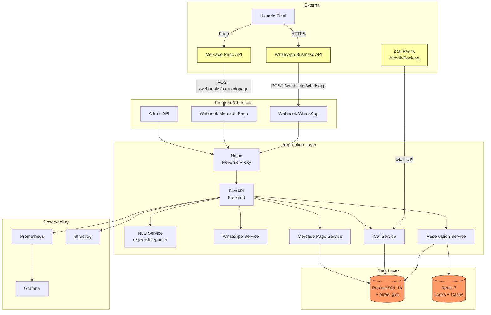

# 🛡️ THREAT MODEL - Sistema MVP de Reservas de Alojamientos

**Versión:** 1.0
**Fecha:** 14 Octubre 2025
**Autor:** Security Team
**Estado:** ACTIVO

---

## 📋 RESUMEN EJECUTIVO

### Descripción del Sistema
Sistema de automatización de reservas con integración WhatsApp Business, Mercado Pago, y sincronización iCal con plataformas externas (Airbnb, Booking). Incluye NLU básico para procesamiento de mensajes.

### Nivel de Riesgo Global
**🟠 MEDIO-ALTO**
- Sistema maneja datos financieros (pagos)
- Acceso a PII de clientes (nombre, teléfono, email, DNI)
- Integración con servicios externos críticos
- Constraint anti double-booking es core del negocio

### Assets Críticos
1. **Datos de Clientes (PII)** - Confidencialidad ALTA
2. **Información de Pagos** - Integridad CRÍTICA
3. **Disponibilidad de Alojamientos** - Integridad CRÍTICA
4. **Webhooks Secrets** - Confidencialidad CRÍTICA
5. **JWT Secrets** - Confidencialidad ALTA

---

## 🏗️ ARQUITECTURA Y DATA FLOW DIAGRAM



### Trust Boundaries
1. **Internet → Nginx:** Entrada externa no confiable (HTTPS obligatorio)
2. **Nginx → FastAPI:** Confiable dentro de Docker network
3. **FastAPI → PostgreSQL/Redis:** Confiable dentro de Docker network
4. **FastAPI → External APIs:** No confiable (validar respuestas)

---

## 🎯 OWASP TOP 10 FOR LLMs - MAPEO AL SISTEMA

> **NOTA:** Este sistema usa NLU básico (regex+dateparser), NO LLM generativo.
> Pero mapeamos OWASP LLM Top 10 para prevención proactiva.

### LLM01: Prompt Injection
**Riesgo:** 🟢 BAJO
**Razón:** Sistema es rule-based (regex), no hay "prompts" interpretables
**Mitigación Actual:**
- ✅ Input sanitization en NLU (regex patterns específicos)
- ✅ No hay system prompts que puedan ser extraídos

**Mitigación Adicional:**
- [ ] Validar inputs contra caracteres de control (NULL bytes, etc.)
- [ ] Rate limiting por usuario para prevenir abuse

---

### LLM02: Insecure Output Handling
**Riesgo:** 🟡 MEDIO
**Razón:** Responses de bot pueden incluir datos estructurados de DB
**Mitigación Actual:**
- ✅ Templates predefinidos en `whatsapp.py`
- ✅ No se retorna SQL/stacktraces en responses

**Mitigación Adicional:**
- [ ] Output sanitization explícita antes de enviar a WhatsApp
- [ ] Validar que PII no se escape accidentalmente en logs

---

### LLM03: Training Data Poisoning
**Riesgo:** 🟢 N/A
**Razón:** No hay modelo ML entrenado, solo regex
**Mitigación:** No aplicable

---

### LLM04: Model Denial of Service
**Riesgo:** 🟡 MEDIO
**Razón:** NLU puede ser abusado con inputs muy largos
**Mitigación Actual:**
- ✅ Rate limiting implementado (Redis-based)
- ✅ Request size limits en Nginx

**Mitigación Adicional:**
- [ ] Timeout en procesamiento NLU (max 5s)
- [ ] Circuit breaker si NLU falla >10 veces/min

---

### LLM05: Supply Chain Vulnerabilities
**Riesgo:** 🟠 ALTO
**Razón:** 32 dependencias Python, algunas críticas (dateparser, fastapi)
**Mitigación Actual:**
- ✅ Gitleaks pre-commit para secrets
- ⚠️ Dependency scanning semanal (no diario)

**Mitigación Adicional:**
- [ ] Ejecutar `pip-audit` + `safety` diario en CI
- [ ] SBOM generation en cada release
- [ ] Pinned versions en requirements.txt (sin `>=`)

---

### LLM06: Sensitive Information Disclosure
**Riesgo:** 🔴 CRÍTICO
**Razón:** Sistema maneja PII (nombre, teléfono, email, DNI)
**Mitigación Actual:**
- ✅ Logs estructurados con structlog
- ⚠️ No hay sanitización explícita de PII en logs

**Mitigación Adicional:**
- [ ] Implementar PII scrubbing en logger (mask phone, email, DNI)
- [ ] Auditar logs para validar no-leakage
- [ ] Encriptación de campos sensibles en DB (future)

---

### LLM07: Insecure Plugin Design
**Riesgo:** 🟢 N/A
**Razón:** No hay sistema de plugins
**Mitigación:** No aplicable

---

### LLM08: Excessive Agency
**Riesgo:** 🟡 MEDIO
**Razón:** Bot puede crear pre-reservas automáticamente
**Mitigación Actual:**
- ✅ Pre-reservas expiran en 48h (mitigación de abuse)
- ✅ Locks Redis previenen doble-booking

**Mitigación Adicional:**
- [ ] Confirmation step antes de crear pre-reserva
- [ ] Limit de N pre-reservas por usuario/día

---

### LLM09: Overreliance
**Riesgo:** 🟢 BAJO
**Razón:** Sistema es rule-based, decisiones determinísticas
**Mitigación Actual:**
- ✅ Test suite valida determinismo (P102)

---

### LLM10: Model Theft
**Riesgo:** 🟢 N/A
**Razón:** No hay modelo ML propietario
**Mitigación:** No aplicable

---

## 🎭 STRIDE THREAT MODELING

### Spoofing Identity

#### T-S01: Webhook Spoofing (WhatsApp)
**Severidad:** 🔴 CRÍTICA
**Descripción:** Atacante envía webhooks falsos pretendiendo ser WhatsApp
**Impacto:** Creación fraudulenta de reservas, DoS
**Mitigación Actual:**
- ✅ `verify_whatsapp_signature()` valida `X-Hub-Signature-256` con HMAC-SHA256
- ✅ Secret en environment variable

**Residual Risk:** 🟢 BAJO (correctamente mitigado)

---

#### T-S02: Webhook Spoofing (Mercado Pago)
**Severidad:** 🔴 CRÍTICA
**Descripción:** Atacante envía webhooks falsos de pagos "aprobados"
**Impacto:** Confirmación de reservas sin pago real
**Mitigación Actual:**
- ✅ `verify_mercadopago_signature()` valida `x-signature` (ts + v1)
- ✅ Callback a MP API para validar payment ID real

**Residual Risk:** 🟢 BAJO (correctamente mitigado)

---

#### T-S03: JWT Token Forgery
**Severidad:** 🟠 ALTA
**Descripción:** Atacante intenta forjar JWT para acceso admin
**Impacto:** Acceso no autorizado a endpoints admin
**Mitigación Actual:**
- ✅ JWT firmado con HS256 + secret de 32 bytes
- ✅ Validación de firma en cada request
- ⚠️ Secret generado con `token_urlsafe(32)` (bueno pero no rotado)

**Residual Risk:** 🟡 MEDIO
**Recomendación:** Implementar JWT secret rotation cada 90 días

---

### Tampering

#### T-T01: Database Tampering (SQL Injection)
**Severidad:** 🔴 CRÍTICA
**Descripción:** Atacante inyecta SQL via inputs de usuario
**Impacto:** Exfiltración/modificación de datos, escalación de privilegios
**Mitigación Actual:**
- ✅ SQLAlchemy ORM (parameterized queries automático)
- ✅ No hay raw SQL queries con f-strings

**Residual Risk:** 🟢 BAJO
**Validación:** Auditar queries raw si existen

---

#### T-T02: Redis Cache Poisoning
**Severidad:** 🟡 MEDIA
**Descripción:** Atacante modifica locks en Redis
**Impacto:** Bypass de anti double-booking
**Mitigación Actual:**
- ⚠️ Redis sin AUTH (solo Docker network trust)
- ✅ Lock keys con UUID aleatorio (difícil predecir)

**Residual Risk:** 🟠 ALTO
**Recomendación:** Habilitar Redis AUTH con password fuerte

---

#### T-T03: Message Tampering in Transit
**Severidad:** 🟡 MEDIA
**Descripción:** MitM modifica mensajes entre client y server
**Impacto:** Datos alterados, phishing
**Mitigación Actual:**
- ✅ HTTPS obligatorio en producción (Let's Encrypt)
- ✅ Nginx configurado con TLS 1.2+

**Residual Risk:** 🟢 BAJO

---

### Repudiation

#### T-R01: Non-Repudiation of Reservations
**Severidad:** 🟡 MEDIA
**Descripción:** Cliente niega haber hecho reserva
**Impacto:** Disputas comerciales
**Mitigación Actual:**
- ✅ Logs estructurados con trace-id
- ✅ Timestamps en DB
- ⚠️ No hay firma digital de cliente

**Residual Risk:** 🟡 MEDIO
**Recomendación:** Enviar confirmación por email con hash de reserva

---

### Information Disclosure

#### T-I01: PII Leakage in Logs
**Severidad:** 🔴 CRÍTICA
**Descripción:** Logs contienen teléfonos, emails, DNIs sin sanitizar
**Impacto:** Violación GDPR/LOPD, multas, pérdida de confianza
**Mitigación Actual:**
- ⚠️ Structlog configurado pero sin PII scrubbing
- ⚠️ Logs en texto plano en `/var/log`

**Residual Risk:** 🔴 ALTO
**Recomendación:** Implementar filtro PII en logger (URGENTE)

---

#### T-I02: Secrets in Git History
**Severidad:** 🔴 CRÍTICA
**Descripción:** API keys, secrets commiteados accidentalmente
**Impacto:** Compromiso total del sistema
**Mitigación Actual:**
- ✅ Gitleaks pre-commit hook
- ✅ `.env` en `.gitignore`

**Residual Risk:** 🟢 BAJO

---

#### T-I03: Sensitive Data in Error Messages
**Severidad:** 🟡 MEDIA
**Descripción:** Stacktraces revelan estructura interna
**Impacto:** Information gathering para atacantes
**Mitigación Actual:**
- ✅ FastAPI debug=False en producción
- ⚠️ Algunos endpoints retornan detalles de error

**Residual Risk:** 🟡 MEDIO
**Recomendación:** Centralizar error handling con messages genéricos

---

### Denial of Service

#### T-D01: Rate Limiting Bypass
**Severidad:** 🟠 ALTA
**Descripción:** Atacante evade rate limiting con IPs diferentes
**Impacto:** DoS, abuse de recursos
**Mitigación Actual:**
- ✅ Rate limiting por IP+path en Redis
- ⚠️ No hay rate limiting por user_id (WhatsApp phone)

**Residual Risk:** 🟠 ALTO
**Recomendación:** Añadir rate limit secundario por user_id

---

#### T-D02: Redis Exhaustion
**Severidad:** 🟡 MEDIA
**Descripción:** Locks llenan Redis hasta OOM
**Impacto:** Caída del servicio
**Mitigación Actual:**
- ✅ Locks con TTL de 1800s (auto-cleanup)
- ⚠️ No hay maxmemory policy configurado

**Residual Risk:** 🟡 MEDIO
**Recomendación:** Configurar `maxmemory-policy=allkeys-lru`

---

#### T-D03: PostgreSQL Connection Exhaustion
**Severidad:** 🟡 MEDIA
**Descripción:** Conexiones no cerradas agotan pool
**Impacto:** 502 Bad Gateway, downtime
**Mitigación Actual:**
- ✅ SQLAlchemy connection pooling
- ⚠️ No hay monitoring de pool usage

**Residual Risk:** 🟡 MEDIO
**Recomendación:** Alertar si connection pool >80%

---

### Elevation of Privilege

#### T-E01: JWT Privilege Escalation
**Severidad:** 🔴 CRÍTICA
**Descripción:** User modifica JWT para obtener privilegios admin
**Impacto:** Acceso completo a dashboard admin
**Mitigación Actual:**
- ✅ JWT firmado (no puede modificar sin secret)
- ⚠️ Payload no valida roles explícitamente

**Residual Risk:** 🟡 MEDIO
**Recomendación:** Añadir campo `role` en JWT y validar en cada endpoint

---

#### T-E02: IDOR (Insecure Direct Object Reference)
**Severidad:** 🟠 ALTA
**Descripción:** User accede a reservas de otros via ID predictible
**Impacto:** Violación de privacidad, modificación de reservas ajenas
**Mitigación Actual:**
- ⚠️ IDs son secuenciales (1, 2, 3...)
- ⚠️ No hay validación de ownership en algunos endpoints

**Residual Risk:** 🔴 ALTO
**Recomendación:** Usar UUIDs + validar ownership en TODOS los endpoints

---

#### T-E03: Admin Endpoint Exposure
**Severidad:** 🟠 ALTA
**Descripción:** Endpoints admin accesibles sin autenticación robusta
**Impacto:** Modificación de alojamientos, reservas, configuración
**Mitigación Actual:**
- ✅ JWT requerido en `/api/v1/admin/*`
- ⚠️ Whitelist de emails en plaintext en config

**Residual Risk:** 🟡 MEDIO
**Recomendación:** Migrar whitelist a DB con roles

---

## 🔒 CONTROLES DE SEGURIDAD IMPLEMENTADOS

| Control | Categoría | Estado | Efectividad |
|---------|-----------|--------|-------------|
| **HTTPS Enforcement** | Transport | ✅ IMPLEMENTADO | ALTA |
| **Webhook Signature Validation** | Authentication | ✅ IMPLEMENTADO | ALTA |
| **JWT for Admin** | Authentication | ✅ IMPLEMENTADO | MEDIA |
| **Rate Limiting (IP)** | DoS Protection | ✅ IMPLEMENTADO | MEDIA |
| **SQLAlchemy ORM** | Injection Prevention | ✅ IMPLEMENTADO | ALTA |
| **Gitleaks Pre-commit** | Secret Management | ✅ IMPLEMENTADO | ALTA |
| **Anti Double-Booking Constraint** | Data Integrity | ✅ IMPLEMENTADO | ALTA |
| **Redis Locks** | Concurrency Control | ✅ IMPLEMENTADO | MEDIA |
| **Structlog** | Audit Logging | ✅ IMPLEMENTADO | MEDIA |
| **Health Checks** | Availability | ✅ IMPLEMENTADO | ALTA |

---

## ⚠️ GAPS Y RECOMENDACIONES

### CRÍTICO (Implementar en 1-2 semanas)

1. **PII Scrubbing en Logs**
   - **Risk:** T-I01 (CRÍTICO)
   - **Effort:** 8h
   - **Implementation:**
     ```python
     import re

     PII_PATTERNS = {
         'phone': re.compile(r'\+?[0-9]{10,15}'),
         'email': re.compile(r'[\w\.-]+@[\w\.-]+\.\w+'),
         'dni': re.compile(r'\b\d{7,8}\b'),
     }

     def scrub_pii(message: str) -> str:
         for name, pattern in PII_PATTERNS.items():
             message = pattern.sub(f'[{name.upper()}_REDACTED]', message)
         return message
     ```

2. **Redis AUTH**
   - **Risk:** T-T02 (ALTO)
   - **Effort:** 2h
   - **Implementation:** Configurar `requirepass` en redis.conf

3. **IDOR Prevention con UUIDs**
   - **Risk:** T-E02 (ALTO)
   - **Effort:** 12h
   - **Implementation:** Migrar IDs a UUID v4, añadir validación ownership

### ALTO (Implementar en 1 mes)

4. **Rate Limiting por User ID**
   - **Risk:** T-D01 (ALTO)
   - **Effort:** 4h

5. **JWT Role-Based Access**
   - **Risk:** T-E01 (MEDIO)
   - **Effort:** 6h

6. **Dependency Scanning Diario**
   - **Risk:** LLM05 (ALTO)
   - **Effort:** 3h (CI setup)

### MEDIO (Implementar en 2-3 meses)

7. **JWT Secret Rotation**
   - **Risk:** T-S03 (MEDIO)
   - **Effort:** 8h

8. **Output Sanitization**
   - **Risk:** LLM02 (MEDIO)
   - **Effort:** 6h

9. **PostgreSQL Connection Pool Monitoring**
   - **Risk:** T-D03 (MEDIO)
   - **Effort:** 4h

---

## 📊 MATRIZ DE RIESGOS

| Threat ID | Threat | Likelihood | Impact | Risk Score | Status |
|-----------|--------|------------|--------|------------|--------|
| T-S01 | Webhook Spoofing (WA) | LOW | CRITICAL | 🟢 LOW | Mitigated |
| T-S02 | Webhook Spoofing (MP) | LOW | CRITICAL | 🟢 LOW | Mitigated |
| T-S03 | JWT Forgery | MEDIUM | HIGH | 🟡 MEDIUM | Partial |
| T-T01 | SQL Injection | LOW | CRITICAL | 🟢 LOW | Mitigated |
| T-T02 | Redis Poisoning | HIGH | HIGH | 🔴 HIGH | **TODO** |
| T-T03 | MitM | LOW | MEDIUM | 🟢 LOW | Mitigated |
| T-R01 | Non-Repudiation | MEDIUM | MEDIUM | 🟡 MEDIUM | Partial |
| T-I01 | PII Leakage Logs | HIGH | CRITICAL | 🔴 HIGH | **TODO** |
| T-I02 | Secrets in Git | LOW | CRITICAL | 🟢 LOW | Mitigated |
| T-I03 | Error Messages | MEDIUM | MEDIUM | 🟡 MEDIUM | Partial |
| T-D01 | Rate Limit Bypass | HIGH | HIGH | 🔴 HIGH | **TODO** |
| T-D02 | Redis Exhaustion | MEDIUM | MEDIUM | 🟡 MEDIUM | Partial |
| T-D03 | DB Conn Exhaustion | MEDIUM | MEDIUM | 🟡 MEDIUM | Partial |
| T-E01 | JWT Privilege Escalation | MEDIUM | CRITICAL | 🟠 HIGH | **TODO** |
| T-E02 | IDOR | HIGH | HIGH | 🔴 HIGH | **TODO** |
| T-E03 | Admin Exposure | MEDIUM | HIGH | 🟡 MEDIUM | Partial |

**Risk Score Legend:**
- 🔴 HIGH: Immediate action required
- 🟠 MEDIUM-HIGH: Action within 2 weeks
- 🟡 MEDIUM: Action within 1 month
- 🟢 LOW: Acceptable residual risk

---

## 🎯 CASOS DE ABUSO

### Caso 1: Reservation Flooding
**Actor:** Competitor / Malicious User
**Goal:** DoS via massive pre-reservations
**Attack Vector:**
1. Atacante automatiza envío de mensajes WhatsApp
2. Crea 100+ pre-reservas en minutos
3. Bloquea disponibilidad real

**Controles:**
- ✅ Rate limiting por IP (actual)
- 🔴 **FALTA:** Rate limiting por user_id (phone)
- 🔴 **FALTA:** CAPTCHA en pre-reserva (future)

---

### Caso 2: Payment Fraud
**Actor:** Fraudster
**Goal:** Confirmar reservas sin pagar
**Attack Vector:**
1. Atacante crea pre-reserva legítima
2. Envía webhook falso de MP con payment_id inventado
3. Sistema confirma reserva sin validar con MP API

**Controles:**
- ✅ Signature validation (actual)
- ✅ Callback a MP API (actual)
- ✅ Idempotency key (actual)

**Residual Risk:** 🟢 BAJO (bien mitigado)

---

### Caso 3: PII Exfiltration
**Actor:** Insider / Compromised Account
**Goal:** Robar datos de clientes
**Attack Vector:**
1. Atacante accede a logs del servidor
2. Extrae teléfonos, emails, DNIs en texto plano
3. Vende base de datos

**Controles:**
- 🔴 **FALTA:** PII scrubbing en logs
- 🔴 **FALTA:** Log encryption at rest
- 🟡 **PARTIAL:** Access control a logs

**Residual Risk:** 🔴 ALTO (acción inmediata)

---

## 📚 REFERENCIAS

- [OWASP LLM Top 10](https://owasp.org/www-project-top-10-for-large-language-model-applications/)
- [STRIDE Threat Modeling](https://learn.microsoft.com/en-us/azure/security/develop/threat-modeling-tool-threats)
- [NIST Cybersecurity Framework](https://www.nist.gov/cyberframework)
- [GDPR Compliance](https://gdpr.eu/)

---

**Próxima Revisión:** 14 Enero 2026 (3 meses)
**Owner:** Security Architect
**Aprobado por:** CTO

**Changelog:**
- 2025-10-14: Versión inicial 1.0 (P201)
